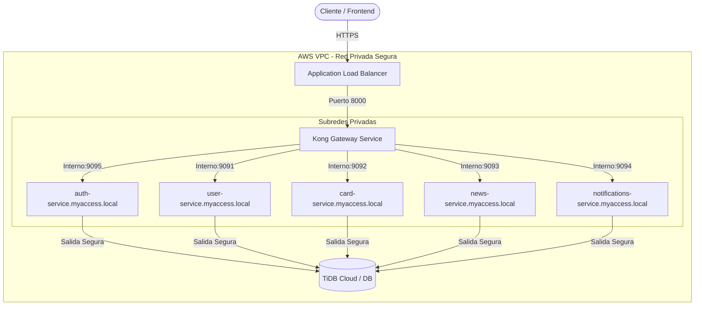

# 🚀 Guía de Migración y Despliegue de MyAccess a AWS ECS (Fargate)

Esta guía te explicará paso a paso cómo mover tus **5 microservicios** y el **Kong Gateway** desde Render hacia **AWS ECS (Elastic Container Service)**. 

Para que sea súper fácil de entender, primero te lo explicaré con una analogía sencilla (como para un niño de 5 años) y luego veremos los pasos técnicos detallados.

---

## 🧸 La analogía de los juguetes (Explicación para un niño de 5 años)

Imagina que tus microservicios son **5 juguetes electrónicos** muy especiales (el robot de usuarios, el de tarjetas, el de noticias, el de notificaciones y el de contraseñas) y **Kong Gateway** es el **Guardián de la Puerta del Parque**.

1. **El Armario de Juguetes (Amazon ECR):** Antes de jugar, guardamos cada juguete en una caja con su nombre en un gran armario llamado ECR.
2. **El Patio de Juegos Privado (VPC - Red Privada):** Para que nadie nos robe los juguetes, los ponemos en un patio cerrado con una cerca alta. Nadie puede verlos desde afuera.
3. **El Teléfono Walkie-Talkie (AWS Cloud Map - Service Discovery):** Como los juguetes están adentro del patio, les damos walkie-talkies. Si el robot de tarjetas quiere hablar con el de contraseñas, solo dice por el canal: *"¡Hola auth-service.myaccess.local!"* y se conectan en secreto sin que nadie en la calle los escuche.
4. **El Guardián del Parque (Kong Gateway):** El guardián está parado en la reja del parque. Cuando un niño de la calle (el Frontend/celular) quiere jugar, el guardián recibe el mensaje, revisa su pase de entrada (Token JWT) y corre a llevárselo en privado al juguete correcto dentro del patio.
5. **El Supervisor del Parque (AWS ECS Fargate):** Es un supervisor mágico que se encarga de que los juguetes siempre tengan pilas. Si un juguete se apaga o se rompe, Fargate lo tira a la basura instantáneamente y pone uno idéntico y nuevo en su lugar en menos de un segundo.

---

## 🌐 Arquitectura Técnica en AWS

Así es como se ve la infraestructura que vamos a configurar:



---

## 🛠️ Paso a Paso Detallado para la Migración

### Paso 1: Subir las imágenes al Armario (Amazon ECR)

Para poder usar contenedores en AWS ECS, primero debemos guardarlos en **Amazon ECR (Elastic Container Registry)**.

Hemos creado un script de automatización en PowerShell en tu proyecto: [push_to_ecr.ps1](file:///c:/Users/MI%20PC/OneDrive/Desktop/MyAccessClean/Backend/push_to_ecr.ps1).

1. Abre una terminal de **PowerShell** en la carpeta `Backend/` de tu proyecto.
2. Asegúrate de tener instalada y configurada la herramienta de AWS (`aws configure` con tus credenciales de AWS).
3. Abre el archivo [push_to_ecr.ps1](file:///c:/Users/MI%20PC/OneDrive/Desktop/MyAccessClean/Backend/push_to_ecr.ps1) y cambia las variables del inicio con tu ID de cuenta AWS y región:
   ```powershell
   $AWS_REGION = "us-east-2"          # Tu región (ej. us-east-1)
   $AWS_ACCOUNT_ID = "048124478038"      # Tu ID de cuenta AWS (12 dígitos)
   ```
4. Ejecuta el script:
   ```powershell
   .\push_to_ecr.ps1
   ```
   *¿Qué hace este script mágicamente por ti?*
   - Inicia sesión en AWS Docker registry.
   - Crea automáticamente los 6 repositorios en AWS ECR si no existen.
   - Compila la imagen Docker de cada uno de los 5 servicios usando el Dockerfile correspondiente.
   - Compila la imagen de Kong Gateway usando la plantilla adaptada para AWS [kong.ecs.yml.template](file:///c:/Users/MI%20PC/OneDrive/Desktop/MyAccessClean/Backend/kong-gateway/kong.ecs.yml.template).
   - Sube todas las imágenes a AWS.

---

### Paso 2: Crear el Patio de Juegos Seguro (AWS VPC y Redes)

1. Entra a tu consola de AWS y busca **VPC**.
2. Haz clic en **Create VPC** y selecciona **VPC and more** (esto creará todo automáticamente).
3. Configura:
   - **Name tag:** `myaccess-vpc`
   - **CIDR block:** `10.0.0.0/16`
   - **Number of Availability Zones (AZs):** `2` (para alta disponibilidad).
   - **Number of Public Subnets:** `2` (para el Load Balancer externo).
   - **Number of Private Subnets:** `2` (donde vivirán los microservicios sin acceso directo de internet).
   - **NAT Gateways:** Selecciona **1 per AZ** o **1 in a single AZ** (necesario para que los microservicios privados puedan conectarse a TiDB Cloud en internet para guardar datos).
4. Haz clic en **Create VPC**.

#### 🔒 Configurar los Security Groups (Las Reglas de Seguridad)
Ve a **VPC -> Security Groups** y crea dos grupos de seguridad:

1. **`myaccess-alb-sg` (Para el Balanceador externo):**
   - **Inbound Rules (Entrada):**
     - HTTP (Puerto 80) desde `0.0.0.0/0` (Todo internet).
     - HTTPS (Puerto 443) desde `0.0.0.0/0` (Si tienes certificado SSL).
2. **`myaccess-ecs-tasks-sg` (Para todos los contenedores ECS):**
   - **Inbound Rules (Entrada):**
     - Permite todo el tráfico TCP de los puertos de tus servicios (`8000`, `9091`, `9092`, `9093`, `9094`, `9095`) pero **únicamente** cuando el origen sea el mismo Security Group `myaccess-ecs-tasks-sg` y el `myaccess-alb-sg`. Esto asegura que nadie en internet pueda llamarlos directamente, sino que todo deba pasar estrictamente por Kong.

---

### Paso 3: Crear la Agenda de Contactos (AWS Cloud Map / Service Discovery)

Para que los microservicios se comuniquen entre sí usando nombres bonitos como `user-service.myaccess.local` en lugar de direcciones IP dinámicas:

1. En la consola de AWS, busca **Cloud Map**.
2. Haz clic en **Create namespace**.
3. Configura:
   - **Namespace name:** `myaccess.local`
   - **Namespace type:** **API calls and DNS queries in VPCs** (Private DNS).
   - **VPC:** Selecciona tu `myaccess-vpc` recién creada.
4. Haz clic en **Create namespace**.

---

### Paso 4: Guardar los secretos bajo llave (AWS Secrets Manager)

En lugar de exponer contraseñas de bases de datos o llaves JWT en texto plano en tus archivos:

1. Busca **Secrets Manager** en la consola de AWS.
2. Haz clic en **Store a new secret**.
3. Selecciona **Other type of secret** (llave/valor).
4. Agrega las siguientes variables con sus valores reales:
   - `DB_USERNAME`
   - `DB_PASSWORD`
   - `JWT_SECRET`
   - `RESEND_API_KEY` (si aplica)
5. Ponle un nombre al secreto, por ejemplo: `myaccess/prod/secrets`.
6. Haz clic en **Store**. Anota el **ARN** del secreto (un texto largo que empieza con `arn:aws:secretsmanager...`), lo usaremos en las Task Definitions.

---

### Paso 5: Escribir las Instrucciones (ECS Task Definitions)

Una Task Definition (Definición de Tarea) le dice a ECS cómo correr tus contenedores: cuánta memoria asignarles, qué imagen de ECR usar y qué variables de entorno inyectar.

Te hemos dejado una plantilla de ejemplo lista para usar en [ecs-task-definition-template.json](file:///c:/Users/MI%20PC/OneDrive/Desktop/MyAccessClean/Backend/ecs-task-definition-template.json).

Debes crear **una Task Definition para cada servicio** en la Consola de AWS (o vía CLI):
1. Ve a **Elastic Container Service (ECS)** -> **Task Definitions** -> **Create new Task Definition (JSON)**.
2. Copia y edita el contenido de [ecs-task-definition-template.json](file:///c:/Users/MI%20PC/OneDrive/Desktop/MyAccessClean/Backend/ecs-task-definition-template.json) para cada servicio, ajustando:
   - El nombre (`family`).
   - La imagen de ECR correspondiente.
   - El puerto interno expuesto (`9091` para user, `9095` para auth, etc.).
   - Las variables de entorno específicas de la base de datos (por ejemplo, `USER_DB_URL` para user-service, `AUTH_DB_URL` para auth-service, etc.).
   - Los secretos mapeados a tu Secret de Secrets Manager.

*Nota: Asegúrate de que el rol de ejecución de la tarea (`ecsTaskExecutionRole`) tenga permisos para leer secretos de Secrets Manager.*

---

### Paso 6: Encender los Juguetes (Crear el ECS Cluster y Servicios)

#### 1. Crear el Cluster
1. En **ECS**, haz clic en **Clusters** -> **Create Cluster**.
2. Nombre: `myaccess-cluster`.
3. Infraestructura: Elige **AWS Fargate (serverless)**.
4. Haz clic en **Create**.

#### 2. Crear los 5 Servicios de Backend Privados
Para cada uno de tus 5 microservicios (`auth-service`, `user-service`, `card-service`, `news-service`, `notifications-service`):
1. Dentro del cluster `myaccess-cluster`, ve a la pestaña **Services** y haz clic en **Create**.
2. Configura:
   - **Launch type:** `FARGATE`.
   - **Application type:** `Service`.
   - **Task Definition Family:** Selecciona la correspondiente (ej. `myaccess-user-service`).
   - **Service name:** El nombre exacto que usaremos en DNS (ej. `user-service`).
   - **Desired tasks:** `1` (puedes subirlo a más para tener alta disponibilidad).
3. En **Networking (Redes):**
   - **VPC:** `myaccess-vpc`.
   - **Subnets:** Elige únicamente las **Subredes Privadas (Private Subnets)**.
   - **Security Group:** Selecciona `myaccess-ecs-tasks-sg`.
   - **Public IP:** **DISABLED** (Apagado. No queremos que tengan IP pública).
4. En **Service Discovery (Cloud Map):**
   - Activa la casilla **Use service discovery**.
   - **Namespace:** `myaccess.local`.
   - **Service discovery name:** El nombre corto (ej. `user-service`). Esto hará que el contenedor sea accesible localmente como `http://user-service.myaccess.local:9091`.
5. Haz clic en **Create**.

#### 3. Crear el Servicio de Kong Gateway (Público con Load Balancer)
Este es el único servicio que estará conectado a Internet:
1. Crea un nuevo servicio en el cluster.
2. **Launch type:** `FARGATE`.
3. **Task Definition:** `myaccess-kong-gateway`.
4. **Service name:** `kong-gateway`.
5. En **Networking (Redes):**
   - **VPC:** `myaccess-vpc`.
   - **Subnets:** Selecciona las **Subredes Públicas (Public Subnets)**.
   - **Security Group:** Selecciona `myaccess-ecs-tasks-sg` y `myaccess-alb-sg`.
   - **Public IP:** **ENABLED**.
6. En **Load Balancing (Balanceador de Carga):**
   - Selecciona **Application Load Balancer (ALB)**.
   - Crea un balanceador de carga nuevo: `myaccess-alb`.
   - Configura el puerto de escucha del balanceador (Port 80 HTTP o 443 HTTPS) apuntando al puerto del contenedor `8000` (que es donde Kong recibe tráfico de la API) o `8443` (para HTTPS).
   - Configura el Health Check path de Kong a `/status` o `/` en el puerto `8000`.
7. En **Service Discovery (Cloud Map):**
   - Registra a Kong como `kong-gateway` en el namespace `myaccess.local`.
8. Haz clic en **Create**.

---

### Paso 7: Configurar tu Frontend para usar AWS

Una vez que tu servicio Kong Gateway se inicie en ECS, el Application Load Balancer (ALB) te dará una URL pública DNS (por ejemplo: `myaccess-alb-123456789.us-east-1.elb.amazonaws.com`).

Para terminar la migración, cambia la URL del backend en tu aplicación Frontend:

```javascript
// En tu Frontend, actualiza la dirección para que apunte al balanceador de carga de AWS
const API_URL = "http://myaccess-alb-123456789.us-east-1.elb.amazonaws.com/api/v1";
```

¡Y listo! Tu sistema completo de 5 microservicios ahora corre de forma segura, escalable y profesional en AWS ECS Fargate, totalmente libre de caídas por inactividad. 🥳🎉
